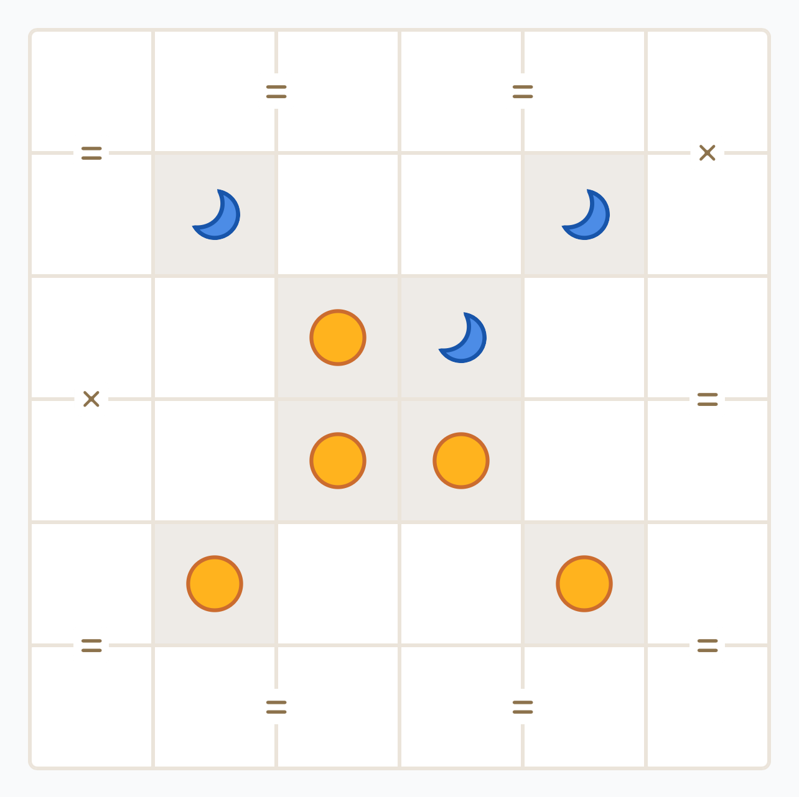
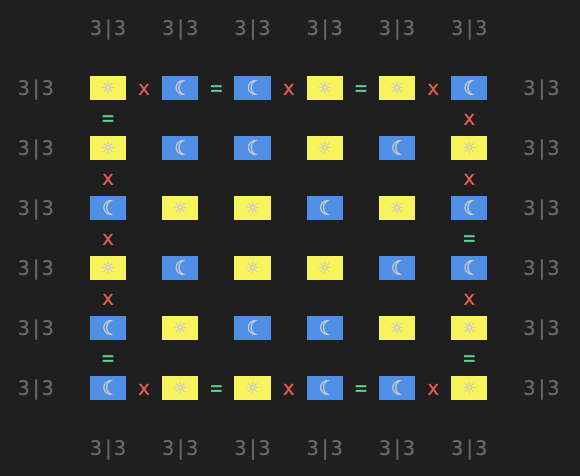
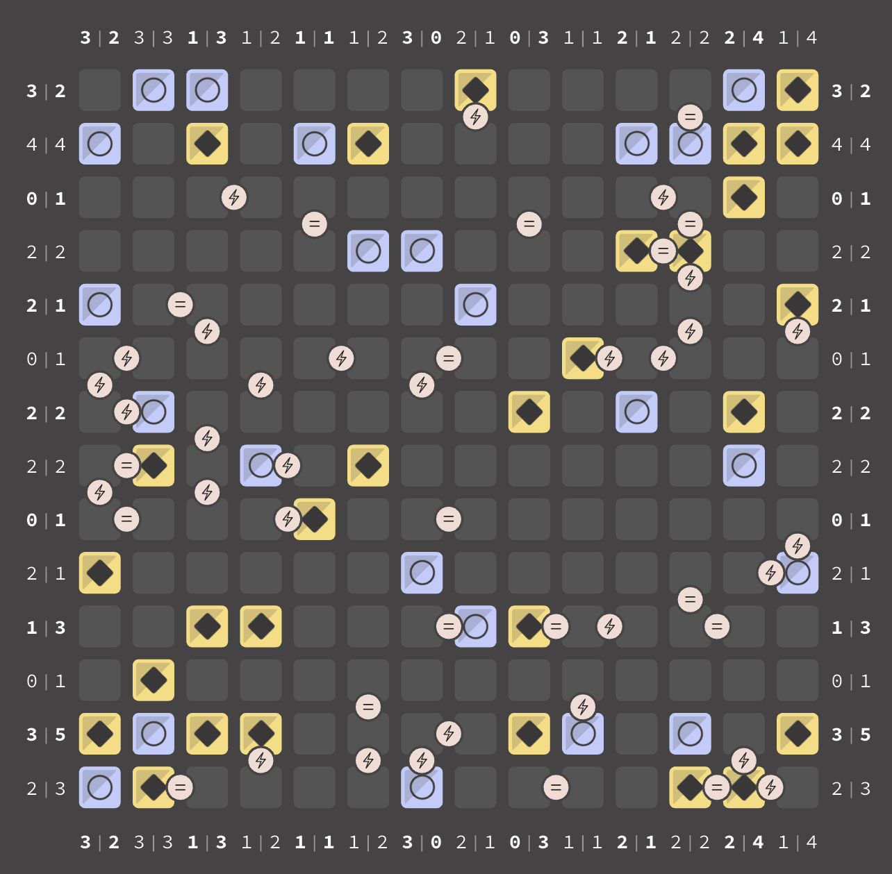
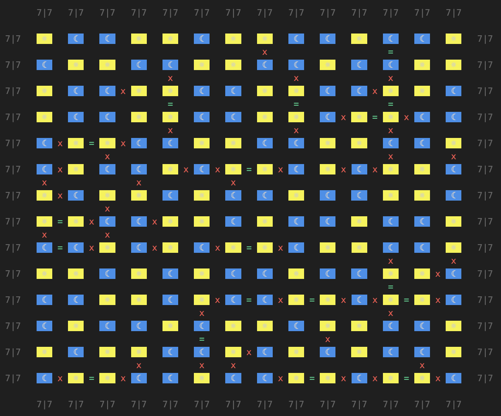
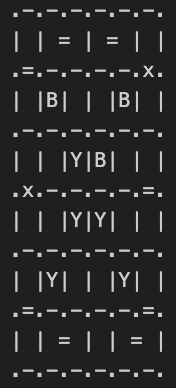
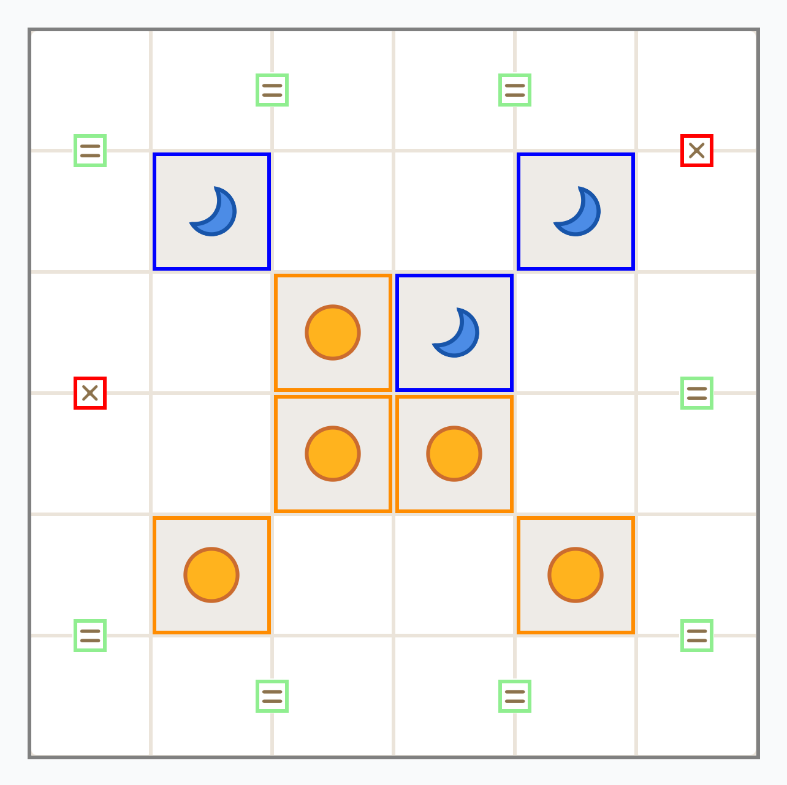
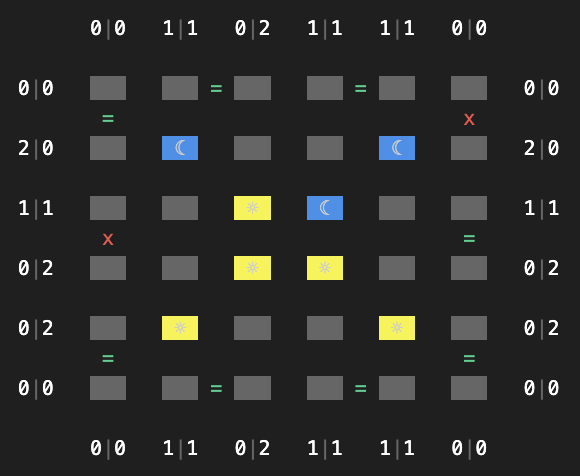

# linkedin-solvers
Solvers for LinkedIn daily games, written in Python.

## Tango
Solver for Tango game on LinkedIn. The program accepts text or image inputs. Also works to solve puzzles from the Tango iOS app.

### LinkedIn
This puzzle was solved in 0.5 seconds.

**Input**

**Output**

### Tango App
This puzzle was solved in 0.9 seconds.

**Input**

**Output**

### How does it work?
#### Input parsing - Text

For text inputs, parsing is straightforward. Here's an example .txt input:

#### Input parsing - Images

For image inputs, the program finds all the cells and edges of the board using OpenCV.

Here's what the program "sees" when parsing an image:

#### Puzzle data structure

We store the parsed cells and edges in a puzzle object. Here's what a puzzle looks after parsing:

#### Solution algorithm

To solve the game, it applies a few simple deduction strategies over and over until it gets stumped. Then, it just makes a guess on an unknown cell and continues solving. If solving the puzzle with that guess runs into a contradiction, we know the cell must be the other symbol. This continues until we have a complete and valid board. The algorithm is a type of recursive backtracking.

Here's an example output of the program

