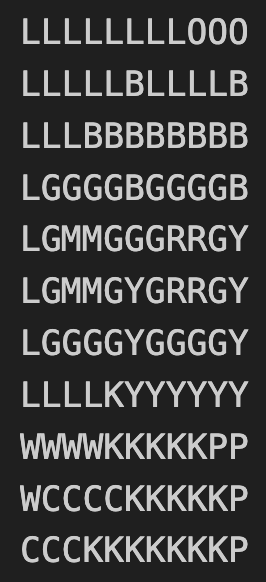
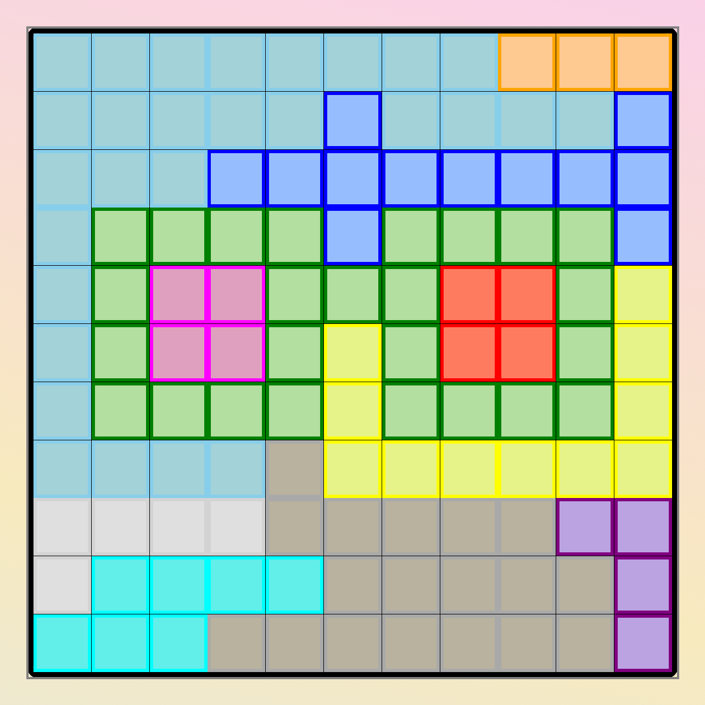
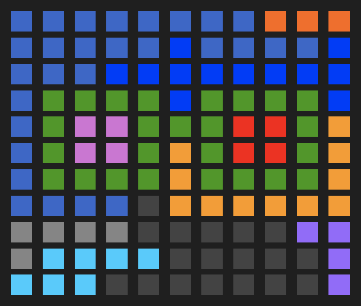

# linkedin-solvers
Solvers for [LinkedIn Tango](https://www.linkedin.com/games/tango/) and [LinkedIn Queens](https://www.linkedin.com/games/tango/), written in Python.

## Tango Solver
Solver for Tango (aka Binairo+).

The solver works for [LinkedIn's Tango](https://www.linkedin.com/games/tango/), the Tango app ([iOS](https://apps.apple.com/us/app/tango-daily-binairo-puzzle), [Android](https://play.google.com/store/apps/details?id=com.iwp.tango)) and [Puzzle Binairo](https://www.puzzle-binairo.com/binairo-plus-6x6-easy/) (text only).

The program accepts text or puzzle screenshots as input.

### Example - LinkedIn Tango
This puzzle was solved in 4 ms.

Image parsing took 0.3 seconds.

#### Input

#### Solution

### Example - Tango App
This puzzle was solved in 0.07 seconds.

Image parsing took 0.6 seconds.

#### Input

#### Solution

### Example Flow
#### 1A. Text Input

#### 1B. Image Input

##### 2. Image Parsing (OpenCV)

#### 3. Initial Board

#### 4. Solution

## Queens Solver

Solver for [LinkedIn's Queens](https://www.linkedin.com/games/queens/).

The program accepts text or puzzle screenshots as input.

### Example - LinkedIn Queens
This puzzle was solved in 92 ms.

Image parsing took 1.0 seconds.

#### Input

#### Solution

### Example Flow
#### 1A. Text Input

#### 1B. Image Input

##### 2. Image Parsing (OpenCV)

#### 3. Initial Board

#### 4. Solution

# How do they work?
To solve the game, the program applies a set of deduction strategies over and over until it gets stumped. 

Then, it makes a guess on an unknown cell and continues solving recursively. If solving runs into a contradiction, we know our guess is incorrect. This continues until we have a complete and valid board.

This combination of known deduction strategies and recursive backtracking improves program performance while ensuring that even very challenging puzzles will be solved.