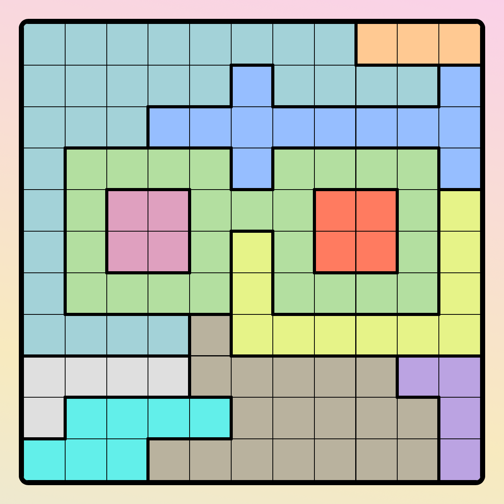

# linkedin-solvers
Solvers for LinkedIn's [Tango](https://www.linkedin.com/games/tango/) and [Queens](https://www.linkedin.com/games/tango/) games, written in Python.

## Tango Solver
This solver works for [LinkedIn's Tango](https://www.linkedin.com/games/tango/) game, the [Tango](https://apps.apple.com/us/app/tango-daily-binairo-puzzle) app, and the [Puzzle Binairo](https://www.puzzle-binairo.com/binairo-plus-6x6-easy/) website.

It can solve text and image inputs.

### Example (LinkedIn Tango)
Puzzle solved in 4 ms.

**Input**

**Output**

### Example (Tango App)
Puzzle solved in 70 ms.

**Input**

**Output**

## Queens Solver

Solver for [LinkedIn's Queens](https://www.linkedin.com/games/queens/) game.

It can solve text or image inputs.

### Example
Puzzle solved in 92 ms.

**Input**

**Output**

# How does it work?
To solve the games, the program applies a set of simple deduction strategies over and over until it gets stumped. 

Then, it makes a guess on an unknown cell and continues solving recursively. If solving runs into a contradiction, we know our guess is incorrect. This continues until we have a complete and valid board.

This combination of known deduction strategies and recursive backtracking improves program performance while ensuring that even the most challenging puzzles can be solved quickly.